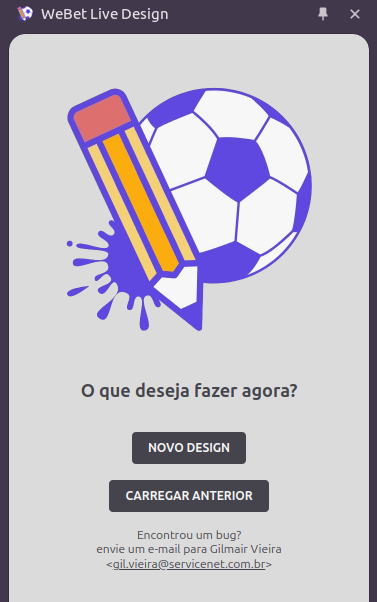

# WeBet Live Design

Extensão do Chrome para edição de design de sites webet em tempo real.

Crie ou edite variáveis dos temas pelo Google Chrome par visualização rápida e dinâmica. 

---

    

## Destaques
- Edite as variávies de cor e veja tudo em tempo real
- Tenha salvo os projetos para que possa editar novamente
- Compatível com todos os projetos WeBet
- Valide a paleta de cores através do navegador
- [TODO] Aplique as variáveis do Figma utilizando [Webet Theme Generator](https://github.com/ogilvieira/wb-figma-theme-gen)

## [TODO] Como instalar 
TODO